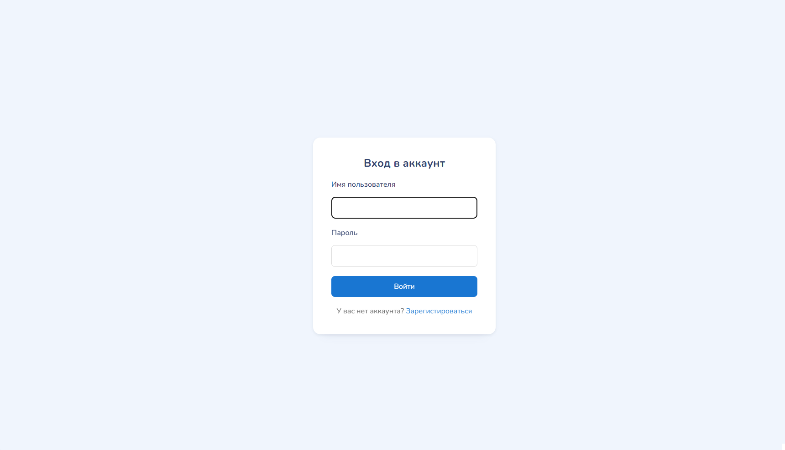
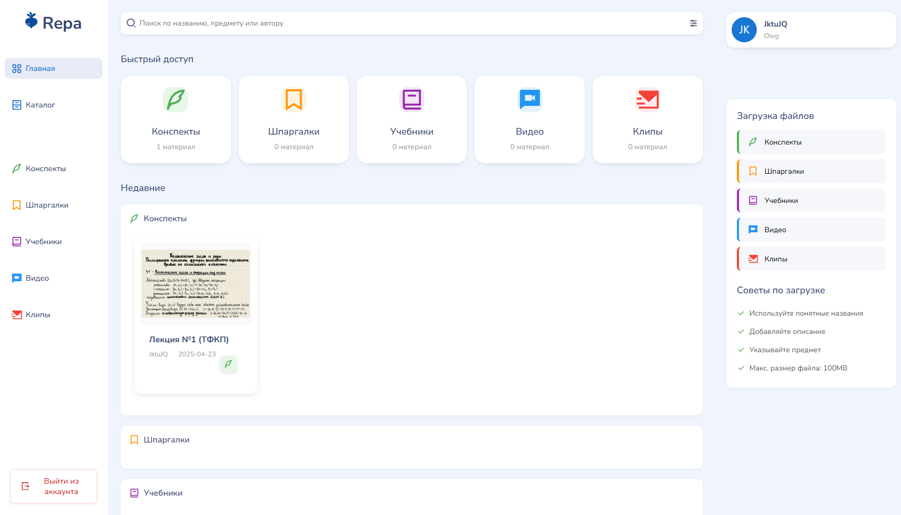
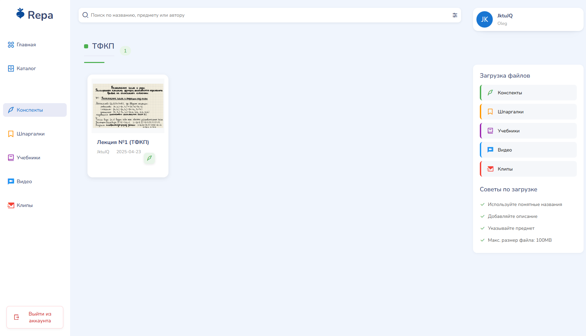
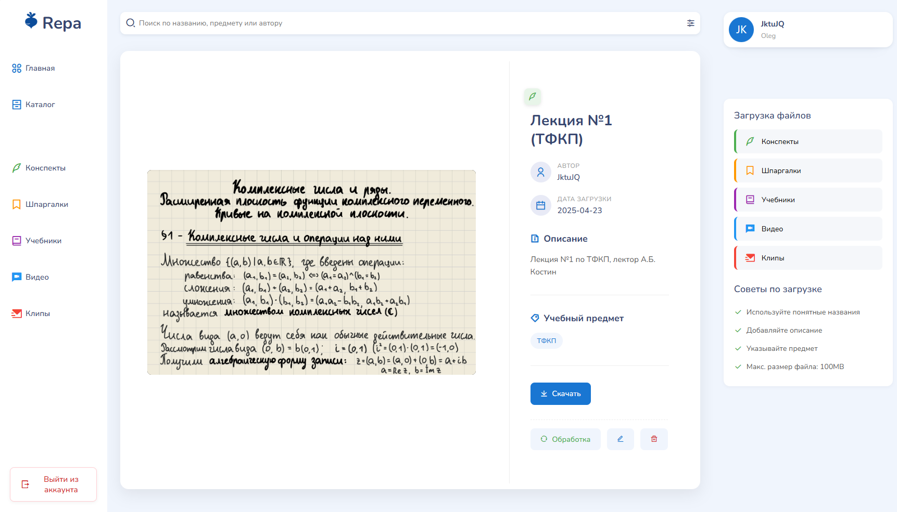
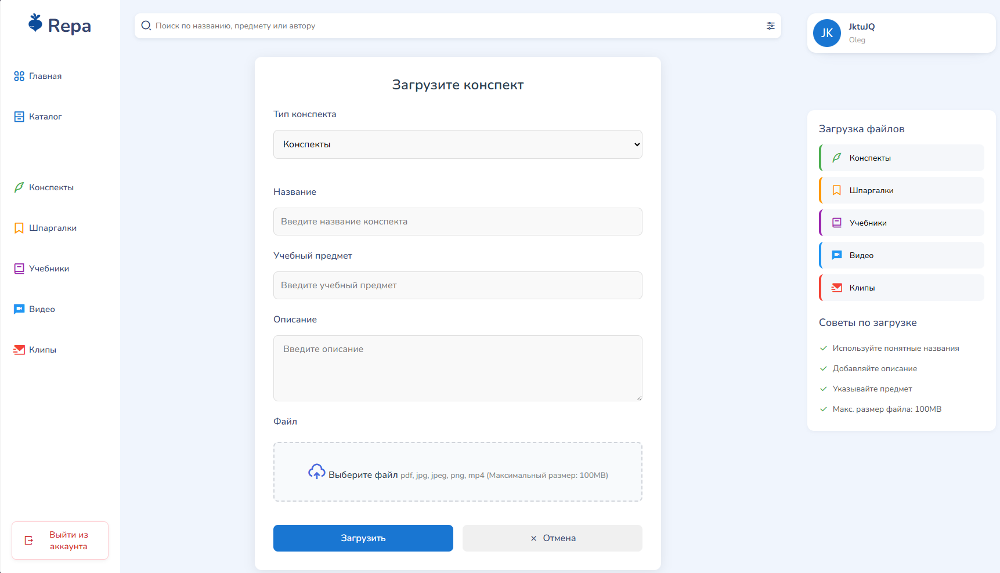

# Универсальная база учебных материалов с возможностью загрузки конспектов, шпаргалок и методичек по различным дисциплинам

## Цель приложения

Распространенная проблема в вузах — поиск учебных материалов.
Много времени отнимает поиск разрозненных источников и 
часто трудно ориентироваться в свалке сотен документов.

**Репа** призвана решить эту проблему,
добавив дополнительный функционал для удобства пользователей.

## Задачи проекта
Чтобы решить проблему, описанную выше, мы решили создали систему, позволяющую 
  1. хранить конспекты и записи лекций организованно,
  2. делиться фотографиями конспектов в хорошем качестве за счет автоматической обработки,
  3. смотреть лекции, а точнее самые важные моменты из них, в формате таких затягивающих вертикальных видео.

## Интерфейс

Страница входа:

Основное меню:

Страница категории:

Страница файла:

Страница загрузки файла:

## Примечание

Данный проект разрабатывался в рамках хакатона в сжатые сроки,
и потому написанный код подвержен техническому долгу и засорению (особенно сильно это касается CSV файла).

Функционал особых функций обработки (вырезка контура из фотографии, конвертация видео в вертикальный формат)
не представлены через сайт, но доступны в ручном режиме через скрипты в папке [ml](ml).

Тем не менее, представленный проект жизнеспособен даже в таком состоянии,
и потому может являться объектом интереса.
