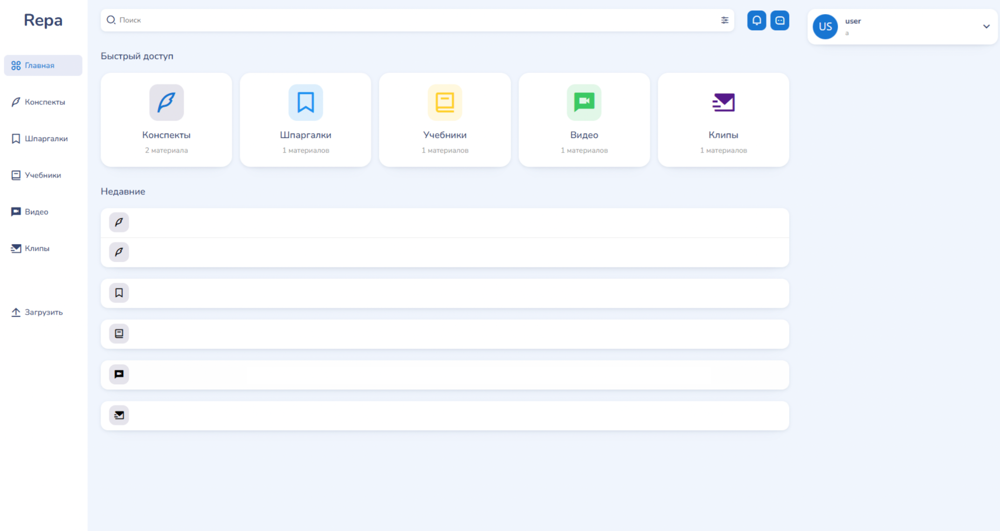
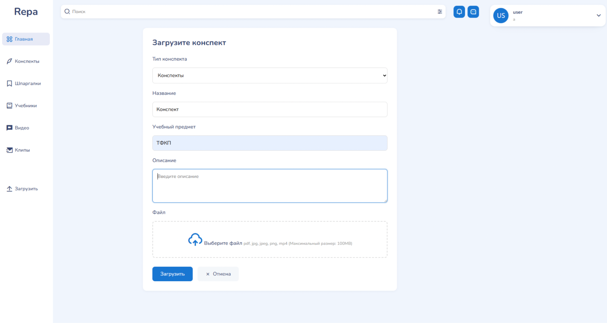
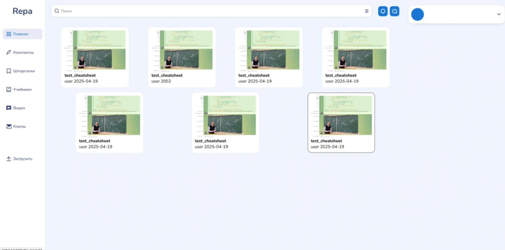

# Универсальная база учебных материалов с возможностью загрузки конспектов, шпаргалок и методичек по различным дисциплинам.

## Цель приложения

Распространенная проблема в вузах — поиск учебных материалов. Много времени отнимает поиск разрозненных источников. Часто трудно ориентироваться в свалке сотен документов. 

## Задачи проекта
Чтобы решить проблему, описанную выше, мы решили создали систему, позволяющую 
  1. хранить конспекты и записи лекций организованно,
  2. делиться фотографии конспектов в хорошем качестве за счет автоматической обработки,
  3. смотреть лекции, а точнее самые важные моменты из них, в формате таких затягивающих вертикальных видео.
  4. 

## Интерфейс

Есть несколько категорий учебных материалов, которые можно посмотреть/создать.

При загрузке, для структурированности контента надо выбрать название предмета. Также можно добавить описание для файлов.

Пример того, как выглядит список добавленных лекций.